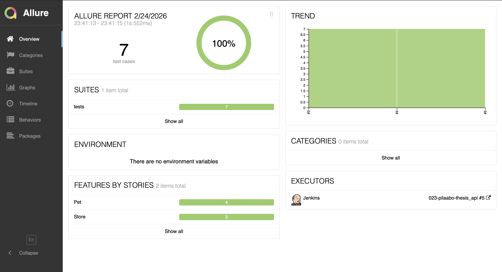
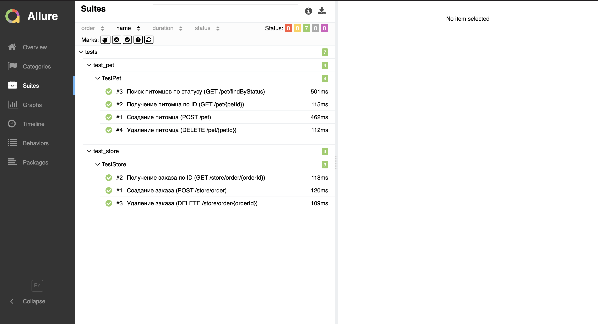
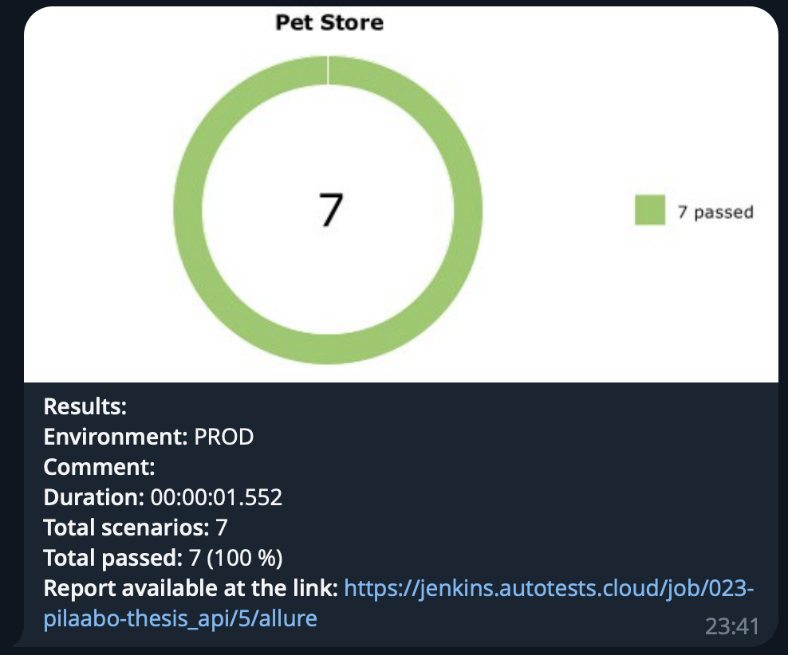

# Pet Store API Автотесты

<p align="center">
  
</p>

## 📑 Содержание

- [Технологии и инструменты](#-технологии-и-инструменты)
- [Покрытый функционал](#-покрытый-функционал)
- [Структура проекта](#-структура-проекта)
- [Запуск тестов](#-запуск-тестов)
- [Сборка в Jenkins](#-сборка-в-jenkins)
- [Allure отчёт](#-allure-отчёт)
- [Уведомление в Telegram](#-уведомление-в-telegram)

---

## 💻 Технологии и инструменты

<p align="center">
  <a href="https://www.python.org/"></a>
  <a href="https://docs.pytest.org/"></a>
  <a href="https://docs.python-requests.org/"></a>
  <a href="https://python-jsonschema.readthedocs.io/"></a>
  <a href="https://allurereport.org/"></a>
  <a href="https://www.jenkins.io/"></a>
  <a href="https://telegram.org/"></a>
</p>

| Инструмент                                               | Описание                                  |
|----------------------------------------------------------|-------------------------------------------|
| [Python](https://www.python.org/)                        | Язык программирования                     |
| [Pytest](https://docs.pytest.org/)                       | Фреймворк для запуска тестов              |
| [Requests](https://docs.python-requests.org/)            | HTTP-библиотека для отправки API-запросов |
| [JSON Schema](https://python-jsonschema.readthedocs.io/) | Валидация JSON-схем запросов и ответов    |
| [Allure Report](https://allurereport.org/)               | Генерация наглядных отчётов               |
| [Jenkins](https://www.jenkins.io/)                       | CI/CD сервер для запуска тестов           |
| [Telegram Bot](https://core.telegram.org/bots)           | Уведомления о результатах прогона         |

---

## ✅ Покрытый функционал

Автотесты покрывают REST API интернет-зоомагазина [Petstore Swagger](https://petstore.swagger.io/):

### 🐾 Питомцы — `test_pet.py` (4 теста)

- ✅ Создание питомца (`POST /pet`) — валидация request- и response-схемы
- ✅ Получение питомца по ID (`GET /pet/{petId}`)
- ✅ Поиск питомцев по статусу (`GET /pet/findByStatus`)
- ✅ Удаление питомца (`DELETE /pet/{petId}`)

### 🛒 Магазин — `test_store.py` (3 теста)

- ✅ Создание заказа (`POST /store/order`) — валидация request- и response-схемы
- ✅ Получение заказа по ID (`GET /store/order/{orderId}`)
- ✅ Удаление заказа (`DELETE /store/order/{orderId}`)

### 🔍 Каждый тест включает

- Валидацию **статус-кода**
- Проверку **значений** в response
- Валидацию **JSON-схемы** ответа
- Логирование запроса и ответа в **Allure** и **консоль**

---

## 📂 Структура проекта

```
pet_store_api_testing/
├── conftest.py                  # Фикстуры: base_url, api-клиент
├── pytest.ini                   # Конфигурация Pytest (testpaths, alluredir)
├── requirements.txt             # Зависимости проекта
├── .gitignore                   # Исключения для git
│
├── schemas/                     # JSON-схемы для валидации
│   ├── __init__.py
│   ├── common.py                # Общая схема API-ответа (code, type, message)
│   ├── pet.py                   # Схемы Pet: request, response, list
│   └── store.py                 # Схемы Store: request, response
│
├── tests/                       # Тестовые модули
│   ├── __init__.py
│   ├── test_pet.py              # Тесты CRUD для /pet (4 теста)
│   └── test_store.py            # Тесты CRUD для /store/order (3 теста)
│
└── utils/                       # Утилиты
    ├── __init__.py
    └── api_client.py            # HTTP-клиент с логированием и Allure-аттачами
```

---

## 🚀 Запуск тестов

### Локальный запуск

```bash
# Установка зависимостей
pip install -r requirements.txt

# Запуск всех тестов
pytest

# Запуск конкретного модуля
pytest tests/test_pet.py
pytest tests/test_store.py

# Генерация Allure отчёта
allure serve allure-results
```

---

##  Сборка в Jenkins

> Ссылка на Job: [Jenkins Job](https://jenkins.autotests.cloud/job/023-pilaabo-thesis_api)

<!-- Раскомментировать и добавить скриншот: -->
<!--  -->

---

##  Allure отчёт

> Ссылка на Allure Report: [Allure Report](https://jenkins.autotests.cloud/job/023-pilaabo-thesis_api/allure)




### Отчёт содержит

- **Feature** — группировка тестов по модулям (`Pet`, `Store`)
- **Шаги (Steps)** — детализированные шаги выполнения через `allure.step()`
- **Вложения** — запрос (метод + тело) и ответ (статус + тело) в текстовом формате

---

##  Уведомление в Telegram



После прохождения тестов бот отправляет уведомление в Telegram-чат с результатами прогона.
